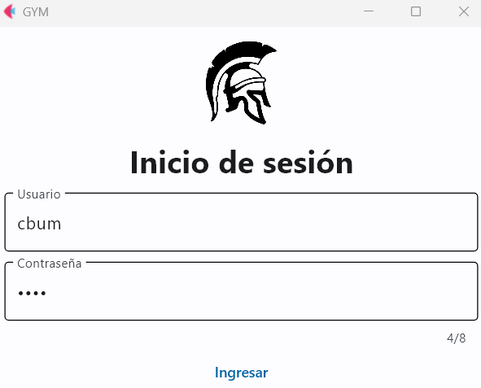

# A myapp Flet app

App that records your training data in the gym.

You must change the data in the section where we connect the database for the app to work.

To run the app:

```
flet run main.py
```

Login:


Menu:


Record your training data:
